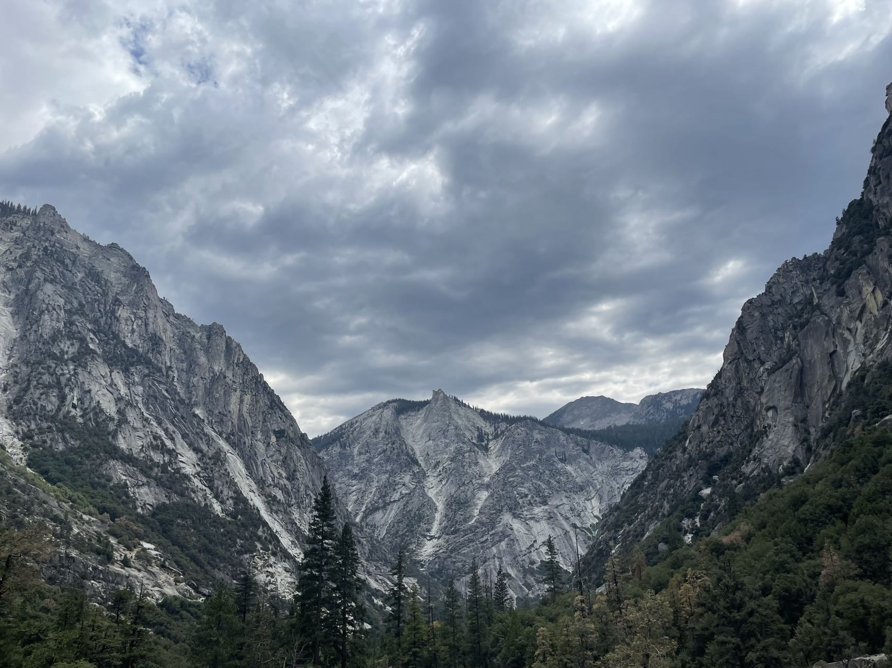

## Brief introduction

I'm currently a graduate student at Columbia University majoring in [Biostatistics(Pharmaceutical track)](https://www.publichealth.columbia.edu). In May 2021, I completed my Bachelor's degree in Economics and a minor in Statistics from [Penn State University](https://www.psu.edu/). My passion for public health made me choose Biostatistics as my future career path. My previous experience working as a research assistant at Penn State allows me to develop advanced working proficiency in R. Now, I have the opportunity to gain more experience in Biostatistics while doing a research project with a professor in my department. 

Here is my resume [link](resume.html).

## More about me
 When I'm free, I like to go on road trips, hiking, watch animations, and play video games. I also enjoy live music, mostly rock and metal

This is a picture that I took during my visit to Kings Canyon National Park this summer.

